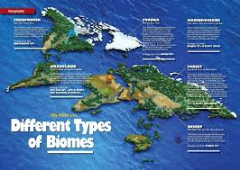
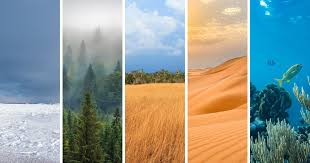
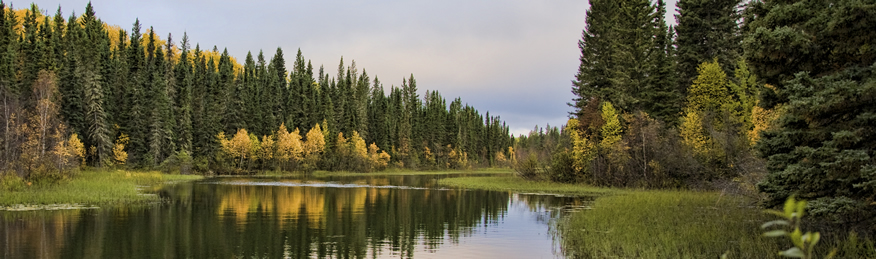
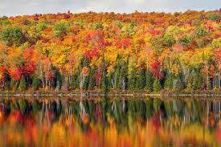
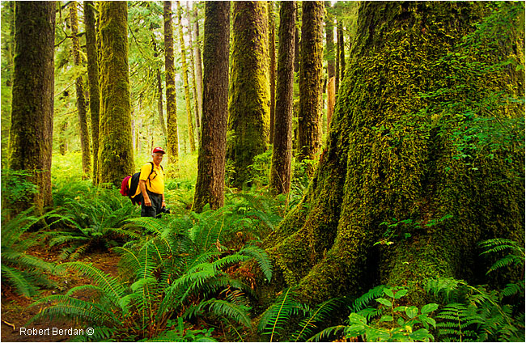
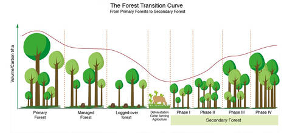
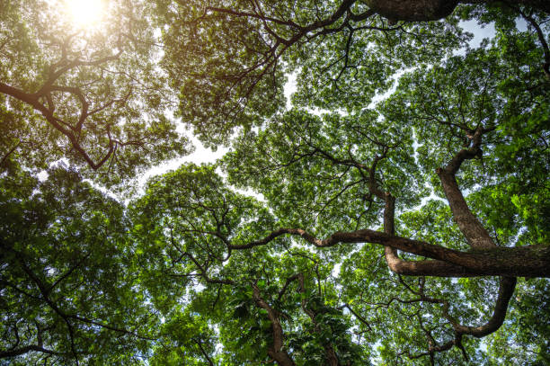
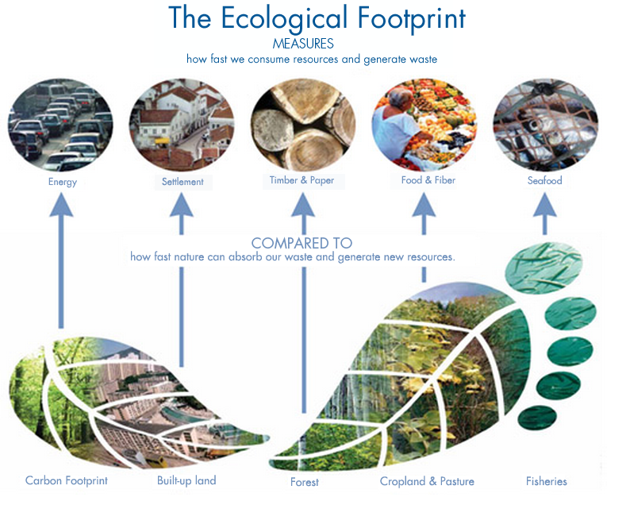

# Forests

- Earth surface is divided into large geographic areas called **Biomes**.  

- Each biome is characterized by distinct climate, vegetation, and animal life.

- **Forests** are a biome where treas are the dominant life-form.

- There are three types of forests:  

1. **Boreal forests:** also known as taiga,
 are found in the subarctic regions and are
 characterized by cold temperatures and coniferous trees.

2.**Temperate forests:** located in mid-latitudes, experience four distinct
seasons and can be either deciduous (trees that lose their leaves seasonally) or
coniferous.

3.**Tropical forests:** near the equator,
 are known for their warm temperatures, high
 rainfall, and exceptional biodiversity.

- Forests can be **dry** or **humid**
- Forests can be:

1. **Primary** or old growth:

- are those that have not been significantly disturbed by human activity.

2.**Secondary**:

- are areas where forests have regrown
 after being cleared or disturbed by human activities or natural events.

## Some relevant terms

**Tree cover:**  

- Encompasses all vegetation taller than 5
meters, including natural forests and tree crops (like rubber, oil palm, etc.).
- May be expressed as a percentage of the area covered by tree canopies, or in
absolute terms (e.g., square kilometers).

**Tree canopy:**  

- Refers to the layer of branches and leaves formed by trees, effectively
creating a "roof" over the ground.

**Tree canopy density, canopy cover or crown cover**:  

- is the proportion of ground area covered
by this tree canopy, usually expressed as a percentage.
- It essentially measures how much of the
ground is shaded or covered by tree foliage when viewed from above.

**Tree cover loss:**

- removal or mortality of that tree cover, regardless of the cause.
Can be :

1. human caused: eg. Deforestation.  
2. due to natural causes: eg. Wildfires

**Some measurement units:**  

- Hectare(ha) : 10,000 square meters.
- Kha : Kilo hectares.  
- Mha : million hectares.  
- Gha : Global hectares.

- A global hectare represents the biologically productive area (cropland,
grazing land, forest, fishing grounds, and built-up land) needed to provide the
resources consumed and absorb the waste generated by a population, but with the
productivity of each land type adjusted to the world average for that year.
- **Ecological Footprint:**  
Global hectares are the primary unit used to express an ecological footprint, which
is a measure of human demand on the Earth's ecosystems.
- **Example:**  
If a country's ecological footprint is 4.5
gha per person, it means, on average, that
each person in that country requires the
equivalent of 4.5 hectares of biologically
productive land and water, with the average
world productivity, to provide for their resource needs and waste absorption.

## Forests in Canada
