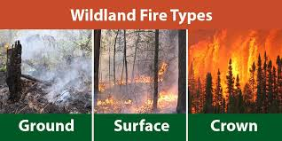

# Prescribed Fires

- Also known as controlled burn or prescribed burn, is the planned and
managed application of fire to a
specific land area to achieve predetermined ecological or land
management objectives, AKA , a healthy
dose of fire.

- Cultural burning is a traditional land management practice used by
Indigenous peoples worldwide for millennia.

- Because of the lack of understanding of fire importance to increase the
reselience of ecosystems, cultural
fires were suppressed and banned.

- [A healthy dose of fire: prescribed fires at Parks Canada](https://parks.canada.ca/nature/science/especes-species/feu-fire)
explains how
prescribed fires are not only preventive, reducing the risk of
wildfires, but is also a naturally
regenerative process and can provide a fresh start for an ecosystem, it allows
 sunlight and greater airflow for different trees to thrive, remove some
 of the competitive trees, it also decreases fungal disease occurence,
 and increase the population of some animals.

- 40 years ago, Parks Canada learned from the negative outcomes of the
 previous conservation approach of suppressing fire shifted the
 conservation approach to using prescribed fire to re-introduce fire
 to the landscape in a controlled manner.

## Before starting a prescribed fire

1. Ecosystem Assessment:
  is the ecosystem fire-dependent(meaning they require fire to meet
  the needs of their inhabitants and preserve biodiversity), fire-sensitive
  (vulnerable to fire), or fire-independent(not significantly impacted by fire).

2. Objectives:
  is it to reduce wildfires, habitat mangement, etc...

3. Site selection criteria:

    - Weather conditions: such as temperature, wind speed and direction.
    - Topography: eg. slope of the area.
    - Smoke management: land managers and air regulators work to choose a
     suitable day, under favorable atmospheric conditions, to allow
     smoke to disburse and dissipate, to reduce impact on nearby communities.

4. Most prescribed fires are planned in spring and spring to prevent major
 fires in warmer dryer seasons.

5. [Ignition plan](https://extension.oregonstate.edu/catalog/pub/em-9387-prescribed-fire-basics-ignition-techniques-tools),
 including tools and fuel used and fire spread pattern.

## Prescribed Fires to Prevent Wildfires

- Wildfires are particularly common in regions
 with dry climates and abundant fuel sources.

- Fuel sources are unchecked vegetation buildup
including dry grass, dead plants, and other
flammable materials, and fuel ladder which are
 small trees that help fire reach tree canopies.

- lightening or man-made fires then cause
wildfires in the presence of these fuel sources.

[Prescribed Fire Basics](https://extension.oregonstate.edu/collection/prescribed-fire-basics)
 is a collection of articles dicussing different aspects of prescribed fires.

## Fire regime

- Fire regime describes the pattern of wildland fire in a particular area or
ecosystem over time. It is influenced by:
fuel, climate, ignition source, topography, land use, fire suppression activities

The pattern include:  
Type:  

1. Ground fire: burning organic materials at varying depth beneath the forest floor.
2. Surface fire: burns through ground-level
materials like dead leaves and vegetation without reaching the tree crowns.
3. Crown fire: Burn tree canopies along with surface fire creating wall of flame.

Frequency:

    - number of fires per year, or fire interval which is number of years 
    between 2 fires.

Intensity:  

- [Fire behavior](https://natural-resources.canada.ca/forest-forestry/wildland-fires/fire-behaviour)

Size:  
area burned in hectares, a large fire is > 200 ha

Seasonality:  

- Seasonal changes influence fuel and weather conditions, and determine leaf
flush the production of new leafs.

Severity:

Cause of ignition:  

 1. Natural(lightening)
 2. Human activity(campfires)

## Fire Regime Zonation Systems In Canada

- A fire regime zonation system divides
 landscapes into distinct geographical areas that share similar fire behaviours
 and environmental characteristics.

1. Fire Regime Units (FRUs):

   - 60 geographical areas across Canada

2. Fire Regime Types (FRTs):

   - 15 classifications across Canada

[stocks et al. 2002](https://cdnsciencepub.com/doi/10.1139/cjfr-2018-0293#refg56)

[Natural resources Canada](https://cdnsciencepub.com/doi/10.1139/cjfr-2018-0293#refg41)

[Canadian National Fire Database (CNFDB)](https://cwfis.cfs.nrcan.gc.ca/ha/nfdb)

[Fire-regime changes in Canada over the last half century](https://cdnsciencepub.com/doi/10.1139/cjfr-2018-0293#refg9)

[Canada’s National Forestry Database](http://nfdp.ccfm.org/en/index.php)
